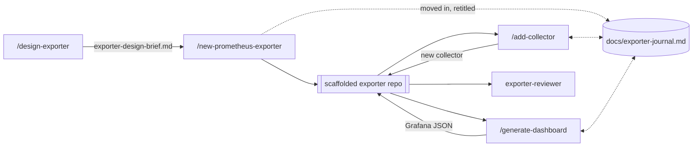

# prometheus-exporter

A Claude Code plugin that scaffolds and hardens production-grade Go
Prometheus exporters. It focuses on *creating* exporters, not reviewing or
operating existing ones.

You get an architecture phase, a buildable repository, a collector pattern
with mockable I/O and a full test triad, container-first tooling,
host-agnostic releases, health and business alerting, and a metrics-docs
check that cannot lie about what the code actually emits.

## Install

```
/plugin marketplace add SckyzO/prometheus-exporter-plugin
/plugin install prometheus-exporter@prometheus-exporter-marketplace
```

Updating, pinning to a tag, and sharing with a team:
[docs/install.md](docs/install.md).

## How it works

Run the commands in order the first time, then `/add-collector` on repeat.



Building an exporter takes several sessions. `/design-exporter` opens a
design brief in your working directory before any repository exists;
`/new-prometheus-exporter` moves it into the generated repository as a
committed project journal, and the two commands you run afterwards read it on
entry and complete it on exit. The collectors still to build, the cardinality
budget and the label vocabulary therefore live on disk instead of in the
context window, which makes `/clear` between two collectors the recommended
move rather than a destructive one.

## Commands

| Command | What it does |
|---|---|
| `/design-exporter` | Settles the data source, target model, collector list and cardinality budget, and writes a reviewable design brief |
| `/new-prometheus-exporter` | Scaffolds a complete, buildable exporter repository with an example collector and its test triad |
| `/add-collector` | Adds a collector plus its test triad to an existing exporter. The one you run most |
| `/generate-dashboard` | Generates business Grafana dashboards from the exporter's own `docs/metrics.md` |
| `exporter-reviewer` | Subagent that audits an exporter against Prometheus conventions, cardinality and docs truthfulness |

Details, flags and per-target-model behaviour:
[docs/commands.md](docs/commands.md).

## Documentation

| | |
|---|---|
| [Commands](docs/commands.md) | What each command does, and what it refuses |
| [Target models](docs/target-models.md) | `single`, `multi`, `multi-instance`: the first decision you make |
| [Configuration and reload](docs/configuration.md) | `--config.file`, hot reload, the concurrency ceiling |
| [Generated repository](docs/generated-repository.md) | The journal, `samples/`, and what is actually covered by tests |
| [Install and pinning](docs/install.md) | Install, update, pin to a tag, and get back off a pin |
| [`ROADMAP.md`](ROADMAP.md) | What each release shipped, and what is planned |
| [`CHANGELOG.md`](CHANGELOG.md) | Release history |

## Development

[`CLAUDE.md`](CLAUDE.md) has the contribution rules for this repository:
commit convention, language, the generic/specific template discipline, and
how to test the plugin. [`TODO.md`](TODO.md) has the current implementation
backlog.

To work on the plugin from a local checkout:

```
claude --plugin-dir .
claude plugin validate .
```

Inside a running session, `/reload-plugins` picks up local changes to
commands, agents, or the skill without a restart.

## License

[Apache-2.0](LICENSE).
