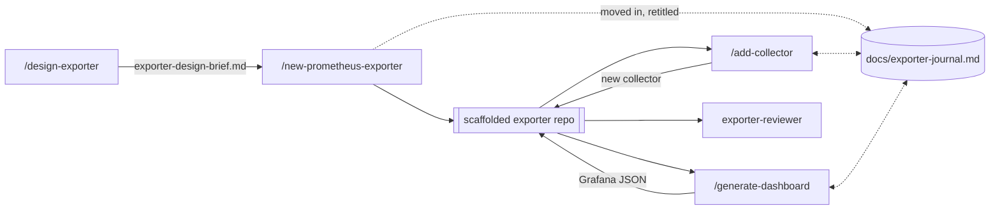
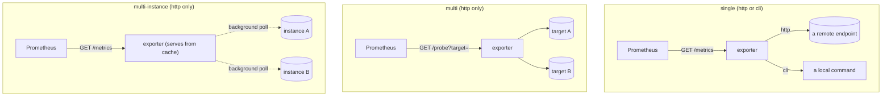

# prometheus-exporter

A Claude Code plugin that scaffolds and hardens production-grade Go
Prometheus exporters: architecture-first design, a collector pattern with
mockable I/O, three target models, a YAML configuration layer that reloads
without a restart, container-first tooling, host-agnostic releases, health
and business alerting, and a metrics-docs check that cannot lie about what
the code actually emits.

It focuses on *creating* exporters, not reviewing or operating existing
ones.

Building an exporter takes several sessions. `/design-exporter` opens a
design brief in your working directory before any repository exists;
`/new-prometheus-exporter` moves it into the generated repository as a
committed project journal, and the two commands you run afterwards read it
on entry and complete it on exit. The collectors still to build, the
cardinality budget and the label vocabulary therefore live on disk instead
of in the context window, which makes `/clear` between two collectors the
recommended move rather than a destructive one.



## What it gives you

- **`/design-exporter`**: the architecture-design phase, run before any code
  is written. It grounds the design in a local API spec, a docs folder or
  URL, context7, or a live instance of the target (opt-in, with secret
  redaction), then writes a reviewable design brief. The phase settles the
  data source (a REST/API, then gRPC, then a CLI wrapper as a last resort; a
  database-only target is out of scope), which of the three target models
  fits, the collector decomposition, and a cardinality budget. The brief is
  the journal before the repository exists: `/new-prometheus-exporter` moves
  it in and retitles it.
- **`/new-prometheus-exporter`**: scaffolds a complete, buildable exporter
  repository with your choice of HTTP or CLI I/O flavor, target model, and
  license. It includes a working example collector with its full test triad,
  a container-first Makefile, and host-agnostic release tooling (GoReleaser,
  with an optional GitHub Actions layer).
- **`/add-collector`**: adds a new collector plus its test triad to an
  existing scaffolded exporter, the action repeated most often over an
  exporter's life. On a `single` scaffold, `--variant background` refreshes
  the collector's cache in a background goroutine so a slow backend never
  blocks a scrape; `multi` refuses that variant, since a collector built per
  probe is discarded when the probe returns, and `multi-instance` is the
  mirror case, where every collector is a background poller already and the
  synchronous variant is refused instead. It derives
  the collector's fixture from a capture under `samples/` when one covers the
  endpoint or command, ticks the collector off the journal with the
  cardinality it actually observed, and regenerates the collector block in
  the exporter's own `README.md` from `docs/metrics.md`.
- **`/generate-dashboard`**: generates one or more business Grafana
  dashboards from a scaffolded exporter's own `docs/metrics.md`, on top of a
  deterministic backbone that emits exportable Grafana JSON. It complements
  the health dashboard every scaffold already ships and never touches it,
  and records each dashboard's audience and method in the journal.
- **`exporter-reviewer`**: a subagent that audits an exporter against
  Prometheus naming/type/label conventions, the generic/specific template
  discipline, cardinality limits, per-collector test coverage, and
  documentation truthfulness.
- **`monitoring/` shipped by default**: health alerting rules for
  Prometheus and a health dashboard for Grafana, generated with every
  scaffold.
- **`make docs-check`**: a generated test wired into every scaffolded
  exporter that fails the build if its metrics documentation names a metric
  or label the code doesn't actually emit.
- **A YAML configuration layer**: every scaffolded exporter accepts
  `--config.file`, which sets any flag the binary declares. On the HTTP
  flavor it also carries the authentication and TLS for the exporter's
  outbound requests, which no flag surface can express; a CLI-flavor build
  has nothing to authenticate and refuses that section at boot rather than
  accepting a setting that would do nothing. On `multi` and `multi-instance`
  builds it also
  declares named credential bundles and reloads without a restart, and it is
  where a `multi-instance` build gets its machine list. See
  [Configuration and reload](#configuration-and-reload).

See [`ROADMAP.md`](ROADMAP.md) for what each release has shipped and what is
planned for later versions.

## The three target models

The target model is chosen once, at scaffold time, and decides how a scrape
reaches whatever is being monitored.



|  | `single` (default) | `multi` | `multi-instance` |
|---|---|---|---|
| I/O flavor | `http` or `cli` | `http` only | `http` only |
| Prometheus scrapes | `GET /metrics` | `GET /probe?target=` | `GET /metrics` |
| Targets come from | a flag on the binary (`http`) or the command fixed at scaffold time (`cli`) | the `target=` parameter, per scrape | `instances:` in `--config.file` |
| The target is reached | during the scrape, or from cache with `--variant background` | during the scrape | in the background, on its own schedule |
| `--config.file` | optional | optional | required |
| Reload without restart | not shipped | `SIGHUP`, `POST /-/reload` | `SIGHUP`, `POST /-/reload` |
| `--exporter.max-requests-per-target` | available | absent | available |

**`multi`** implements Prometheus's own multi-target exporter pattern: each
`/probe` request builds a registry and collector set scoped to the requested
target. `?module=` names one or more modules from the configuration file; the
selected modules' collector lists combine, their credentials do not. A
request that selects two credential-bearing modules gets a `400`, and so
does one that resolves no credentials against a file that declares some.

**`multi-instance`** exists for Prometheus's five-minute staleness window,
not for slow targets: one process watches a fixed list of machines, polls
each in the background on its own schedule, and serves every scrape from
cache. It also suits a fleet whose per-machine credentials are known ahead
of time. Each machine's series carry one identifying label, named at scaffold
time by `scaffold.sh --instance-label` (default `target`) rather than by a
runtime flag, so `docs/metrics.md` can state it as fact.

## Configuration and reload

`--config.file` is empty by default, and an exporter started without it
reads nothing from disk. The exception is `multi-instance`, which has no
instance list without it and refuses to start.

The file carries `flags:` (any flag the binary declares except `config.file`
itself, keyed by its long name) and `http_client_config:` (basic auth,
bearer token, TLS and client
certs for the exporter's outbound requests, HTTP flavor only). `multi` and
`multi-instance` builds add `modules:`, named credential bundles that a
`/probe` request selects per request on `multi` and that each instance
references by name on `multi-instance`; a `single` build refuses that
section at boot rather than loading something nothing would read.
`multi-instance` adds `instances:`, the machines to watch. Precedence,
highest first: the command line, then the file, then the process
environment, then each flag's own default.

`multi` and `multi-instance` builds re-read that file on `SIGHUP` (always
active) or on `POST /-/reload` (behind `--web.enable-lifecycle`, default
`false`, which follows Prometheus's own posture for a mutating endpoint;
`blackbox_exporter` and `snmp_exporter` both expose theirs ungated).
Everything that can fail runs before anything is mutated, so a failed reload
leaves the running configuration untouched, drives
`..._exporter_config_last_reload_successful` to `0` and logs at error.

A reload applies the shape of the configuration: an instance or a module
added, removed, re-addressed, re-labelled or re-pointed, plus any secret
written inline. It is not what rotates a file-backed credential.
`prometheus/common` already re-reads `password_file`, `bearer_token_file`,
`ca_file`, `cert_file` and `key_file` from disk on every outbound request,
with no reload involved. That is also why a `single` build ships no reload
at all: its documentation points at those `_file` variants instead.

Two changes are refused rather than half-applied:

- **A changed `flags:` section** refuses the whole reload, naming every
  changed key. Flags are rendered into command-line arguments exactly once,
  at startup, so a running process cannot adopt a new value for one.
- **A change to the *set* of instance label *keys*** on `multi-instance` is
  refused with a restart-required error. A Prometheus registry never
  releases a metric family's label-name dimension once registered, so
  re-registering under a different key set would panic. Changing a label
  *value* reloads hot, with no poller restarted.

Separately, `--exporter.max-requests-per-target` (default `0`, unlimited)
caps in-flight outbound work so one slow target cannot starve its siblings.
What it caps differs by build, which matters before you pick a number: one
ceiling per distinct target address on a `single` HTTP build, one ceiling
for the whole process on a `single` CLI build, and one per watched instance
on `multi-instance`. `..._exporter_request_wait_seconds` records how long a
request waited for a slot, by `outcome`, so queuing shows up in monitoring
instead of quietly lengthening scrape times.

## What a scaffolded repository carries

Alongside the buildable Go exporter, four artifacts let a build survive a
compaction or a cleared context between sessions. The scaffold ships three
of them; `/new-prometheus-exporter` writes the fourth, the journal, straight
after scaffolding.

- **`docs/exporter-journal.md`**, committed. Eight frozen sections, each
  created by exactly one command. It carries only the half no file in the
  repository can state
  about itself: the collectors still to build, the cardinality budget as an
  intention, the credential convention, the shared label vocabulary. Each
  command reconciles it against the repository on entry and reports every
  correction rather than trusting a stale claim. It is tracked by git
  because an untracked file is destroyed by `git clean -xdf`, and a journal
  that vanishes silently is worse than no journal, because by then it is
  trusted.
- **`samples/`**, gitignored except its own `README.md`. Raw material
  captured from the monitored target, plus the target's own API
  documentation. It is ignored on two independent grounds: captured output
  is not anonymized and routinely carries real hostnames, tenants and
  credentials, and vendor documentation carries redistribution terms the
  generated repository does not get to decide. Nothing moves out of it. A
  fixture under `internal/collector/testdata/` is a trimmed, anonymized copy
  and the original stays, because one capture commonly covers several
  collectors.
- **`CLAUDE.md`**, written once at scaffold time. It states the four
  invariants fixed at scaffold (namespace, target model, flavor, default
  port), where each kind of state lives, and the one gate that decides
  whether a change is finished.
- **A collector block in the exporter's own `README.md`**, between
  `<!-- BEGIN GENERATED COLLECTORS -->` and
  `<!-- END GENERATED COLLECTORS -->`, regenerated in full from
  `docs/metrics.md` so the front page lists every collector the exporter
  actually has.

The journal never refuses anything. When it is absent or unreadable, every
command still runs its full job end to end, and only then offers to build
one: from scratch when the file is missing, behind a `.bak` when its headers
are damaged, and nothing is written before you answer. Exporters scaffolded
before the journal keep working, with no migration of any kind.

The three scaffold-side artifacts above, `samples/`, `CLAUDE.md` and the
collector-block markers, are covered by the six-cell golden matrix, which
scaffolds and builds every cell. The journal is not: it is written by
`/new-prometheus-exporter` rather than by the scaffold script, and no test
in this repository touches it. Neither does anything cover what the commands
do with it afterwards, reading it on entry, reconciling it against the
repository, degrading when it is absent, deriving a fixture from `samples/`,
and regenerating that collector block. All of that is prose executed by a
model, no test in this repository exercises any of it, and none is claimed
to.

## Distribution & install

This repository is its own marketplace: `.claude-plugin/marketplace.json`
lists the `prometheus-exporter` plugin with this repository as its source.

**Add the marketplace, then install the plugin:**

```
/plugin marketplace add SckyzO/prometheus-exporter-plugin
/plugin install prometheus-exporter@prometheus-exporter-marketplace
```

**Update** the marketplace listing to pick up new releases:

```
/plugin marketplace update prometheus-exporter-marketplace
```

**Uninstall:**

```
/plugin uninstall prometheus-exporter@prometheus-exporter-marketplace
```

### Pinning a version

Every release is tagged `vX.Y.Z`. To pin the install to a specific tag
instead of whatever the marketplace currently points to, add the
marketplace via its full git URL with the tag appended as a `#` ref:

```
/plugin marketplace add https://github.com/SckyzO/prometheus-exporter-plugin.git#v0.7.0
```

### Sharing with a team

Declare the marketplace and enable the plugin for every collaborator by
adding both to the repository's `.claude/settings.json`:

```json
{
  "extraKnownMarketplaces": {
    "prometheus-exporter-marketplace": {
      "source": {
        "source": "github",
        "repo": "SckyzO/prometheus-exporter-plugin"
      }
    }
  },
  "enabledPlugins": {
    "prometheus-exporter@prometheus-exporter-marketplace": true
  }
}
```

Collaborators who trust the repository folder are then prompted to install
the marketplace and the plugin automatically.

### Before you install anything

Installing a plugin means trusting its source: plugins run with your own
user privileges and can execute arbitrary code on your machine. Only add
marketplaces and install plugins from sources you trust, and check what a
plugin contains before installing it.

## Development

[`CLAUDE.md`](CLAUDE.md) has the contribution rules for this repository:
commit convention, language, the generic/specific template discipline, and
how to test the plugin. [`TODO.md`](TODO.md) has the current implementation
backlog.

To work on the plugin from a local checkout:

```
claude --plugin-dir .
claude plugin validate .
```

Inside a running session, `/reload-plugins` picks up local changes to
commands, agents, or the skill without a restart.

## License

[Apache-2.0](LICENSE).
