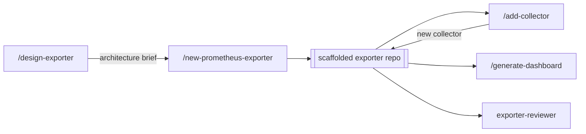

# prometheus-exporter

A Claude Code plugin that scaffolds and hardens production-grade Go
Prometheus exporters: architecture-first design, a collector pattern with
mockable I/O, container-first tooling, host-agnostic releases, health and
business alerting, and a metrics-docs check that cannot lie about what the
code actually emits.

It focuses on *creating* exporters, not reviewing or operating existing
ones.



## What it gives you

- **`/design-exporter`**: the architecture-design phase, run before any code
  is written. It grounds the design in a local API spec, a docs folder or
  URL, context7, or a live instance of the target (opt-in, with secret
  redaction), then writes a reviewable architecture brief. The phase settles
  the data source (a REST/API, then gRPC, then a CLI wrapper as a last
  resort; a database-only target is out of scope), the single- or
  multi-target shape, the collector decomposition, and a cardinality budget.
- **`/new-prometheus-exporter`**: scaffolds a complete, buildable exporter
  repository with your choice of HTTP or CLI I/O flavor and your choice of
  license. It includes a working example collector with its full test triad,
  a container-first Makefile, and host-agnostic release tooling (GoReleaser,
  with an optional GitHub Actions layer). Add `--target-model multi` (HTTP
  only) to scaffold a `/probe?target=` exporter instead of a single-target
  one.
- **`/add-collector`**: adds a new collector plus its test triad to an
  existing scaffolded exporter, the action repeated most often over an
  exporter's life. `--variant background` refreshes the collector's cache in
  a background goroutine so a slow backend never blocks a scrape.
- **`/generate-dashboard`**: generates one or more business Grafana
  dashboards from a scaffolded exporter's own `docs/metrics.md`, on top of a
  deterministic backbone that emits exportable Grafana JSON. It complements
  the health dashboard every scaffold already ships and never touches it.
- **`exporter-reviewer`**: a subagent that audits an exporter against
  Prometheus naming/type/label conventions, the generic/specific template
  discipline, cardinality limits, per-collector test coverage, and
  documentation truthfulness.
- **`monitoring/` shipped by default**: health alerting rules for
  Prometheus and a health dashboard for Grafana, generated with every
  scaffold.
- **`make docs-check`**: a generated test wired into every scaffolded
  exporter that fails the build if its metrics documentation names a metric
  or label the code doesn't actually emit.
- **An optional YAML configuration file**: every scaffolded exporter accepts
  `--config.file`. The file sets any flag the binary declares, and carries the
  authentication and TLS for the exporter's outbound requests, which no flag
  surface can express. It is opt-in: the flag defaults to empty and an
  exporter started without it reads nothing from disk.

See [`ROADMAP.md`](ROADMAP.md) for what each release has shipped and what is
planned for later versions.

## Distribution & install

This repository is its own marketplace: `.claude-plugin/marketplace.json`
lists the `prometheus-exporter` plugin with this repository as its source.

**Add the marketplace, then install the plugin:**

```
/plugin marketplace add SckyzO/prometheus-exporter-plugin
/plugin install prometheus-exporter@prometheus-exporter-marketplace
```

**Update** the marketplace listing to pick up new releases:

```
/plugin marketplace update prometheus-exporter-marketplace
```

**Uninstall:**

```
/plugin uninstall prometheus-exporter@prometheus-exporter-marketplace
```

### Pinning a version

Every release is tagged `vX.Y.Z`. To pin the install to a specific tag
instead of whatever the marketplace currently points to, add the
marketplace via its full git URL with the tag appended as a `#` ref:

```
/plugin marketplace add https://github.com/SckyzO/prometheus-exporter-plugin.git#v0.6.0
```

### Sharing with a team

Declare the marketplace and enable the plugin for every collaborator by
adding both to the repository's `.claude/settings.json`:

```json
{
  "extraKnownMarketplaces": {
    "prometheus-exporter-marketplace": {
      "source": {
        "source": "github",
        "repo": "SckyzO/prometheus-exporter-plugin"
      }
    }
  },
  "enabledPlugins": {
    "prometheus-exporter@prometheus-exporter-marketplace": true
  }
}
```

Collaborators who trust the repository folder are then prompted to install
the marketplace and the plugin automatically.

### Before you install anything

Installing a plugin means trusting its source: plugins run with your own
user privileges and can execute arbitrary code on your machine. Only add
marketplaces and install plugins from sources you trust, and check what a
plugin contains before installing it.

## Development

[`CLAUDE.md`](CLAUDE.md) has the contribution rules for this repository:
commit convention, language, the generic/specific template discipline, and
how to test the plugin. [`TODO.md`](TODO.md) has the current implementation
backlog.

To work on the plugin from a local checkout:

```
claude --plugin-dir .
claude plugin validate .
```

Inside a running session, `/reload-plugins` picks up local changes to
commands, agents, or the skill without a restart.

## License

[Apache-2.0](LICENSE).
