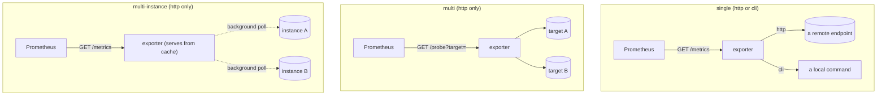

# Target models

The target model is chosen once, at scaffold time, and decides how a scrape
reaches whatever is being monitored. It is the first decision
`/prometheus-exporter:design-exporter` settles, and changing it later is a
regeneration rather than an edit.

|  | `single` (default) | `multi` | `multi-instance` |
|---|---|---|---|
| I/O flavor | `http` or `cli` | `http` only | `http` only |
| Prometheus scrapes | `GET /metrics` | `GET /probe?target=` | `GET /metrics` |
| Targets come from | a flag on the binary (`http`) or the command fixed at scaffold time (`cli`) | the `target=` parameter, per scrape | `instances:` in `--config.file` |
| The target is reached | during the scrape, or from cache with `--variant background` | during the scrape | in the background, on its own schedule |
| `--config.file` | optional | optional | required |
| Reload without restart | not shipped | `SIGHUP`, `POST /-/reload` | `SIGHUP`, `POST /-/reload` |
| `--exporter.max-requests-per-target` | available | absent | available |

## `multi`

Implements Prometheus's own multi-target exporter pattern: each `/probe`
request builds a registry and collector set scoped to the requested target.

`?module=` names one or more modules from the configuration file; the
selected modules' collector lists combine, their credentials do not. A
request that selects two credential-bearing modules gets a `400`, and so
does one that resolves no credentials against a file that declares some.

## `multi-instance`

Exists for Prometheus's five-minute staleness window, not for slow targets:
one process watches a fixed list of machines, polls each in the background
on its own schedule, and serves every scrape from cache. It also suits a
fleet whose per-machine credentials are known ahead of time.

Each machine's series carry one identifying label, named at scaffold time by
`scaffold.sh --instance-label` (default `target`) rather than by a runtime
flag, so `docs/metrics.md` can state it as fact.

---

See also: [configuration and reload](configuration.md), which differs by
target model more than anything else in this plugin.
